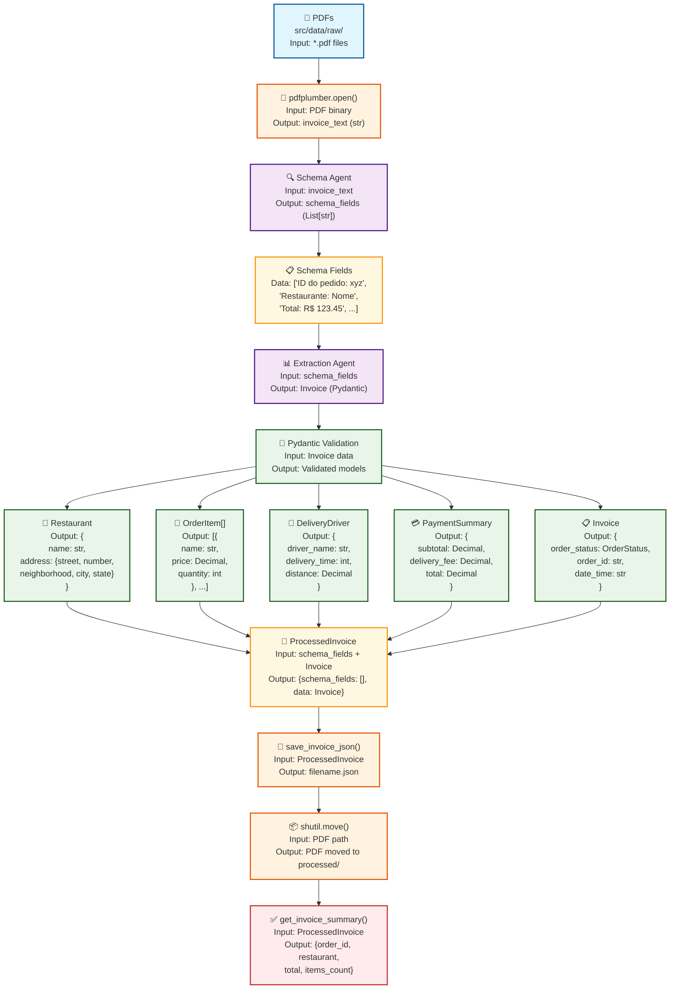

# Invoice AI Processor - Extrator Inteligente de Faturas

[](https://www.python.org/downloads/)
[](https://ai.pydantic.dev/)
[](https://github.com/jsvine/pdfplumber)
[](https://opensource.org/licenses/MIT)
[]()

## 🏆 Créditos e Inspiração

Este projeto foi desenvolvido com base nos conceitos apresentados no **Workshop de Prompt Engineering & RAG** da **[Engenharia de Dados Academy](https://engenhariadadosacademy.com.br/)**.

## 📋 Descrição

Sistema inteligente de extração e processamento de faturas de delivery (Uber Eats) usando **Pydantic AI** e **OpenAI GPT**. O projeto converte automaticamente faturas em PDF para dados estruturados em JSON, extraindo informações detalhadas sobre pedidos, restaurantes, entregadores e pagamentos. 

**Pipeline automatizado**: Os PDFs são processados da pasta `data/raw/` e, após extração bem-sucedida, são **automaticamente movidos** junto com os JSONs gerados para a pasta `data/processed/`, mantendo organização e rastreabilidade completa do fluxo de dados.

## 🎯 Objetivos

- ✅ **Extração Automática**: Converter PDFs de faturas em dados estruturados JSON
- ✅ **Precisão de Dados**: Capturar todos os campos relevantes (pedido, restaurante, entregador, pagamento)
- ✅ **Pipeline Limpo**: Fluxo simples e eficiente PDF → Texto → IA → JSON
- ✅ **Validação Rigorosa**: Usar Pydantic para validação automática de tipos e estrutura
- ✅ **Código Limpo**: Arquitetura modular e manutenível

## Estrutura do Projeto

```
ws-prompt-rag-test/
├── 📁 src/
│   ├── main.py                    # Script principal de execução
│   ├── 📁 scripts/
│   │   ├── models.py              # Modelos Pydantic (Invoice, Restaurant, etc.)
│   │   ├── processor.py           # Agents AI (Schema + Extraction)
│   │   ├── utils.py               # Utilitários (PDF, JSON, resumos)
│   │   └── suppress_warnings.py   # Configuração supressão avisos
│   └── 📁 data/
│       ├── raw/                   # PDFs de entrada
│       └── processed/             # JSONs processados
├── requirements.txt               # Dependências Python
├── pyproject.toml                 # Configuração do projeto
├── CLAUDE.md                      # Instruções para Claude AI
└── README.md                      # Este arquivo
```

## Pré-requisitos

- **Python 3.12+**
- **Chave da API OpenAI**
- **Sistema operacional**: Linux, macOS ou Windows

## Instalação Rápida

### 1. Clone o Repositório
```bash
git clone <url-do-projeto>
cd <nome-do-projeto>
```

### 2. Instale as Dependências com UV
```bash
# Instalar UV (se ainda não tiver)
curl -LsSf https://astral.sh/uv/install.sh | sh

# Instalar dependências do projeto
uv sync
```

**Ou usando pip tradicional:**
```bash
pip install --upgrade pip
pip install -r requirements.txt
```

### 3. Configure a API OpenAI
```bash
# Crie o arquivo .env na raiz do projeto
echo "OPENAI_API_KEY=sk-...SUA_CHAVE_AQUI..." > .env
```

## Modelos de Dados

### Hierarquia dos Modelos

```python
Invoice (Raiz)
├── order_id: str
├── date_time: str  
├── restaurant: Restaurant
│   ├── name: str
│   ├── address: str
│   ├── total_reviews: int
│   └── average_rating: Decimal
├── items: List[OrderItem]
│   ├── name: str
│   ├── price: Decimal
│   └── quantity: int
├── deliver_driver: DeliveryDriver
│   ├── driver_name: str
│   ├── delivery_time: int
│   ├── distance: Decimal
│   └── average_speed: Decimal
└── payment: PaymentSummary
    ├── subtotal: Decimal
    ├── delivery_fee: Decimal
    ├── service_fee: Decimal
    ├── discount: Decimal
    ├── driver_tip: Decimal
    └── total: Decimal
```

## Como Usar

### 1. Prepare os PDFs
```bash
# Coloque suas faturas PDF em:
src/data/raw/
```

### 2. Execute o Processador
```bash
python src/main.py
```

### 3. Verifique os Resultados
```bash
# JSONs processados aparecerão em:
src/data/processed/
```

## Pipeline de Processamento - Fluxo Schema-Driven com Dados



### **Fluxo de Dados Detalhado:**

| Etapa | Input | Processamento | Output |
|-------|-------|---------------|--------|
| **📄 PDF Load** | `*.pdf` files | File reading | Binary data |
| **📖 Text Extract** | PDF binary | `pdfplumber.open()` | `invoice_text: str` |
| **🔍 Schema Agent** | `invoice_text` | OpenAI analysis | `schema_fields: List[str]` |
| **📊 Extract Agent** | `schema_fields` | OpenAI structured extraction | `Invoice: Pydantic` |
| **🔧 Validation** | Invoice data | Pydantic models | 5 validated objects |
| **🔄 Consolidation** | `schema_fields + Invoice` | Data merge | `ProcessedInvoice` |
| **💾 JSON Save** | `ProcessedInvoice` | `json.dump()` | `filename.json` |
| **📦 File Move** | PDF path | `shutil.move()` | PDF in `processed/` |
| **📊 Summary** | `ProcessedInvoice` | Stats generation | Summary dict |


### Exemplo de Saída
```json
{
  "schema_fields": [
    "ID do pedido: b8e2-4d9c",
    "Restaurante: Hanami Temakeria", 
    "Total: R$ 259,25"
  ],
  "data": {
    "order_id": "b8e2-4d9c",
    "date_time": "2025-07-25T18:12:00",
    "restaurant": {
      "name": "Hanami Temakeria",
      "address": "Perdizes, São Paulo - SP",
      "total_reviews": 1458,
      "average_rating": "4.7",
    },
    "payment": {
      "subtotal": "235.00",
      "delivery_fee": "7.50",
      "service_fee": "11.75",
      "discount": "-20.00",
      "driver_tip": "25.00", 
      "total": "259.25"
    }
  }
}
```

## Tecnologias Utilizadas

| Tecnologia | Versão | Função |
|------------|--------|---------|
| **Python** | 3.12+ | Linguagem principal |
| **Pydantic AI** | 0.4.9 | Framework IA + validação |
| **OpenAI GPT** | 4o-mini | Modelo de linguagem |
| **pdfplumber** | 0.11.7 | Extração de texto PDF |
| **python-dotenv** | - | Gerenciamento de variáveis |

## Soluções de Problemas

### ❌ Erro: "FontBBox warnings"
**Solução**: O projeto inclui `suppress_warnings.py` que elimina automaticamente esses avisos.

### ❌ Erro: "OpenAI API Key not found"
**Solução**: 
```bash
# Verifique se o arquivo .env existe e contém:
OPENAI_API_KEY=sk-...sua_chave_aqui...
```

### ❌ Erro: "No PDFs found"
**Solução**: Coloque seus PDFs em `src/data/raw/`


## Melhorias Futuras

- [ ] Suporte a múltiplos provedores de IA (Anthropic, Google)
- [ ] Detectar e processar comentários, correções e observações escritas à mão sobre faturas digitalizadas
- [ ] Interface web para upload de PDFs
- [ ] API REST para integração
- [ ] Suporte a outros tipos de faturas
- [ ] Dashboard de métricas e analytics

